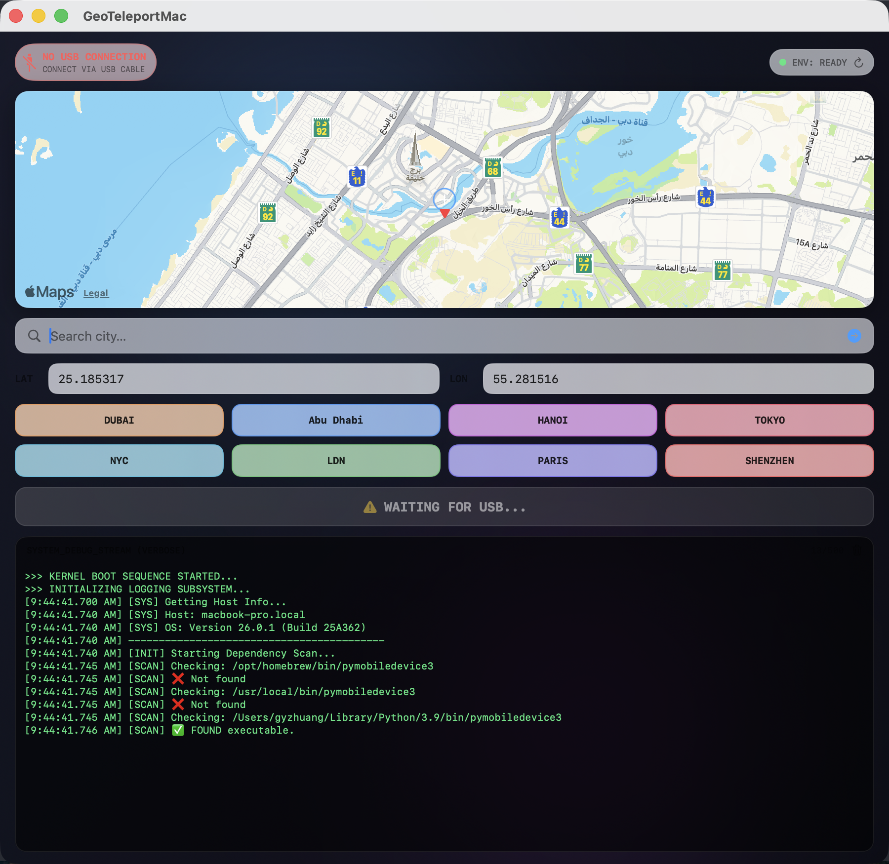

# GeoTeleportMac

> A native macOS SwiftUI utility that teleports a tethered iPhone's GPS to any coordinate on Earth — point, click, jump.

<p align="center">
  
</p>

---

## ✨ 特性

- **🧭 原生地图选点** — 基于 `MKMapView`（AppKit 桥接），地图拖动即实时回写经纬度
- **🔍 城市搜索** — 接入 macOS 26 新版 `MKGeocodingRequest`，输入城市名直达
- **⚡️ 一键传送** — 调用已安装的 `pymobiledevice3` 向已连接 iPhone 注入 `simulate-location`
- **🪟 iOS 风格玻璃 UI** — `.regularMaterial` / `.thickMaterial` + 彩色光斑氛围层，深色自适应
- **🔌 USB 热插拔监听** — 原生 `ioreg` 扫描，2 秒内自动反馈 "HARDWARE CONNECTED"
- **📱 iOS 版本识别** — 自动读取 `ProductVersion`；iOS 17+ 自动弹提示横幅，**一键 Launch Terminal** 直接帮你开好 tunneld 窗口，只差输 sudo 密码
- **🛡️ 防假成功** — 实测 pymobiledevice3 在 iOS 17+ 无 tunneld 时会 exit 0 不报错但 GPS 实际没动；App 增加两层守卫：① 前置 `pgrep` 检测 tunneld，没跑就禁用 Jump 并把状态卡显示为"Start tunneld first"；② 即使 exit 0，只要 stderr 含 `rsd / tunneld / traceback` 等关键词，也翻案为失败并给人话原因
- **🔁 依赖自动扫描 + 手动重扫** — 内置 `which -a` 兜底，覆盖 Homebrew 与 Python 3.9–3.13 用户级安装
- **✅ 坐标校验** — LAT ∈ [-90, 90]、LON ∈ [-180, 180]，非法值实时红边并禁用传送
- **💾 状态持久化** — 上次坐标与搜索词通过 `@AppStorage` 跨启动保留
- **🪧 单条状态消息** — 取代过去的日志大屏，把"现在能不能用 / 在做什么 / 成功失败"压成一行彩色卡片；失败时给人话原因（"iOS 17+ tunnel isn't running" 而非 "Exit code 1"）
- **🔧 可折叠 Debug 日志** — 500 行环形缓冲仍在，默认折叠；点右上 `Log ˅` 才展开，排错时再看

## 🖼️ 界面一览

| 模块 | 说明 |
| --- | --- |
| 顶栏状态胶囊 | 左：iPhone 连接态（绿=已连接 / 红=未连接）；右：CLI 环境态 + 重扫按钮 |
| 交互地图 | 拖动地图或点击预设城市，中心准星为当前选中经纬度 |
| 搜索栏 | 输入城市/地名 → 回车 或 点击 ▶，调用 MapKit 地理编码 |
| 坐标输入 | 手动精确输入/修改；超界立即标红 |
| 城市预设 | 8 个高频城市（DUBAI / TOKYO / NYC / LDN / PARIS / SHENZHEN 等） |
| 传送按钮 | 仅在 USB + ENV + 坐标全部就绪时激活 |
| 调试日志 | 时间戳 + 分类前缀（SYS / HARDWARE / GEO / KERNEL / RESULT） |

## 🛠️ 安装

### 1. 运行前置依赖

```bash
# Homebrew (若未装)
brew install pipx
pipx install pymobiledevice3
# 或
pip3 install pymobiledevice3
```

工具安装后点右上角 🔄 "Rescan"，状态胶囊应变为 `ENV: READY`。

### 2. 连接 iPhone

用 USB 线连接 iPhone，在手机上信任这台 Mac。
顶栏左侧状态胶囊变绿：`HARDWARE CONNECTED · READY TO INJECT`。

### 3. 启用 iOS 开发者模式

iOS 16+ 需要在手机上：**Settings → Privacy & Security → Developer Mode → ON**，重启后信任此电脑。

### 4. iOS 版本兼容性

| iOS 版本 | 是否可用 | 说明 |
| --- | :---: | --- |
| iOS ≤ 16 | ✅ | 直接可用，App 自己搞定所有事 |
| iOS 17 / 18 / **26** | ⚠️ | 需要额外先启动 **tunneld**（见下节） |
| **Android / HarmonyOS** | ❌ | 完全不支持。pymobiledevice3 只讲 Apple 协议栈（usbmux / lockdownd / RemoteXPC），安卓请改用 ADB + mock location |

#### 🔐 iOS 17+ 专用步骤：启动 tunneld

Apple 从 iOS 17 开始把 DeveloperDiskImage 换成了 RemoteXPC 隧道，所有 `developer` 子命令都必须走这条隧道；且隧道需要 root 权限才能建立。

**App 会自动帮你搞定**：检测到 iOS ≥ 17 时，顶栏下方会弹黄色横幅，点 **Launch** 按钮即自动打开 Terminal 并预填命令，你只需要输 Mac 密码，窗口保持打开即可。

横幅里的命令形如：

```bash
sudo /Users/<you>/Library/Python/3.9/bin/pymobiledevice3 remote tunneld
```

— 注意是**绝对路径**，不是 `sudo python3 -m pymobiledevice3`。因为 Mac 上通常装着多个 Python（Homebrew Python 3.14 / Xcode Python / 用户级 Python 3.x），`sudo` 的 PATH 会挑到根本没装 pymobiledevice3 的那个，报 `No module named pymobiledevice3`。App 自己扫出来的绝对路径直接走对应 shebang 的 Python，绕开这个坑。

tunneld 一旦跑起来，状态卡和横幅会自动消失，Jump 按钮解锁。**不要关那个 Terminal 窗口**——关了就断了。

### 5. 构建与运行

```bash
git clone https://github.com/gyzhuang-eng/GeoTeleportMac.git
cd GeoTeleportMac
xcodebuild -scheme GeoTeleportMac -destination 'platform=macOS' -configuration Release build
cp -R ~/Library/Developer/Xcode/DerivedData/GeoTeleportMac-*/Build/Products/Release/GeoTeleportMac.app /Applications/
open /Applications/GeoTeleportMac.app
```

或直接用 Xcode 打开 `GeoTeleportMac.xcodeproj` 按 ⌘R。

## 🚀 使用流程

1. 打开 App，确认两个顶栏胶囊都是绿色
2. 方式一：在地图上拖动 → 中心准星即目标点
3. 方式二：搜索框输入城市名 → ↩︎
4. 方式三：手动修改 LAT / LON 输入框
5. 方式四：点击预设城市按钮
6. 检查坐标，点击 **`>>> CONFIRM & JUMP <<<`**
7. 日志区会显示进程 PID、stdout/stderr 与最终退出码
8. 成功后 iPhone 的定位立即跳到目标坐标（Apple Maps、微信、滴滴等皆同步）

## 🏗️ 项目结构

```
GeoTeleportMac/
├── GeoTeleportMacApp.swift     # @main 入口
├── ContentView.swift           # 全部 UI + 业务逻辑 (V9.2)
│   ├── 玻璃主题 (glassPanel / glassCapsule)
│   ├── NativeMapView (NSViewRepresentable for MKMapView)
│   ├── 依赖扫描 (findDependency + which -a 兜底)
│   ├── USB 监听 (ioreg 每 2s 轮询)
│   ├── 地理编码 (MKGeocodingRequest · macOS 26)
│   └── CLI 执行 (Process → pymobiledevice3)
└── Assets.xcassets             # 图标
```

## ⚙️ 技术栈

- **Swift** 5 · **macOS** 26.0 (Tahoe) · **SwiftUI** + **AppKit** (via `NSViewRepresentable`)
- **MapKit** / **CoreLocation** — `MKGeocodingRequest`, `MKMapView`, `MKCoordinateRegion`
- **IOKit via ioreg(8)** — 无需权限的 USB 硬件探测
- **pymobiledevice3** (Python) — `developer simulate-location set <lat> <lon>` 注入真实设备

## 📦 下一步待办

- [ ] USB 监听切换为 IOKit `IOServiceAddMatchingNotification` 事件驱动（替代 2s 轮询）
- [ ] 拆分 `ContentView.swift` 为 `DeviceMonitor` / `TeleportService` / `GlassTheme` / `NativeMapView`
- [ ] 改造为 `async/await` + `AsyncStream` 日志流
- [ ] 坐标 source-of-truth 状态机（消除 `updateNSView` 的 0.0001 阈值 hack）
- [ ] Swift 6 严格并发
- [ ] Developer ID + Hardened Runtime + notarize 发布流水线

## ⚠️ 合规声明

本工具需要：

- iOS 开发者模式
- 自签名运行（目前 `Sign to Run Locally`，ad-hoc）
- `pymobiledevice3` 第三方工具（[doronz88/pymobiledevice3](https://github.com/doronz88/pymobiledevice3)）

**仅供开发调试、地理围栏功能自测、无障碍与可达性测试等合法场景使用。** 使用者需对自身行为合规性负责（App Store 条款、目标国家/地区法律、所使用的商业 App 的 ToS 等）。作者不对任何滥用场景负责。

## 📄 许可证

MIT © 2026 gyzhuang-eng
