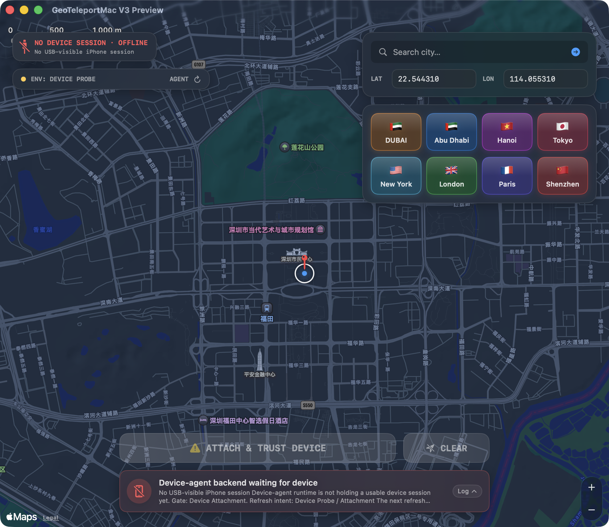
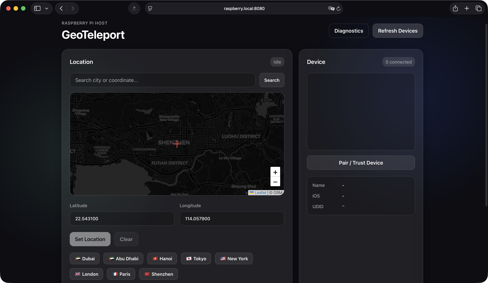

# GeoTeleport

GeoTeleport is a tool suite for setting a USB-connected iPhone's simulated GPS location. The V3 architecture is built around a pure-Rust `native-device-core`, eliminating the need for Python, Xcode, Homebrew, `pipx`, or `pymobiledevice3` for end users.

It features two distinct clients powered by the same Rust core:
1. **GeoTeleportMac:** A native macOS SwiftUI app.
2. **Raspberry Pi Host:** A headless, portable Linux daemon with a beautiful web UI for on-the-go simulation.

## Previews

### 1. GeoTeleportMac
*(Replace the image below with your latest macOS App screenshot)*


### 2. Raspberry Pi Host Web UI
*(Replace the image below with your latest Raspberry Pi Web UI screenshot)*


## Features & Compatibility

- **No Python Environment Required:** Direct communication with the iOS lockdown and DVT services via Rust.
- **iOS 16 & Earlier:** Uses the native lockdown `com.apple.dt.simulatelocation` service.
- **iOS 17, iPadOS 18, and iOS 26+:** Uses a custom `ios17-location-daemon` path routing through the RSD service (Requires Developer Mode enabled).
- **Multi-Device Support:** Manage multiple iPhones simultaneously.

---

## 1. GeoTeleportMac (macOS App)

The macOS client provides a native SwiftUI HUD overlaid on a full-window `MKMapView`.

### Build & Package
Use Xcode's standard DerivedData location.

```bash
# Build the shared Rust core
cd native-device-core
cargo build --release
cd ..

# Build the macOS App via Xcode
xcodebuild -project GeoTeleportMac.xcodeproj -scheme GeoTeleportMac -configuration Debug build
```

To create a local unsigned DMG from a Release build:
```bash
./build_dmg.sh
```
*Note: Distribution is currently unsigned. Users must intentionally bypass the macOS first-run warning via System Settings -> Privacy & Security.*

---

## 2. Raspberry Pi Host (Portable Linux Daemon)

The Raspberry Pi host turns a Pi (e.g., Pi Zero 2 W) into a portable "location spoofing" box. It serves a responsive glassmorphism Web UI accessible directly from your phone's browser.

- **Portable mDNS:** Access the UI at `http://raspberry.local:8080` by tethering the Pi to your iPhone's USB network or Wi-Fi hotspot.
- **Zero Config Web UI:** Built-in Axum web server embeds the map interface directly into the Rust binary.

### Cross-Compile & Deploy (from macOS)

You can compile the Pi binaries on your fast Mac and push them over SSH using the provided script:

```bash
# Ensure target is installed and cargo-zigbuild is available
rustup target add aarch64-unknown-linux-gnu
brew install cargo-zigbuild

# Compile and deploy directly to the Pi
./scripts/deploy_to_pi.sh
```

See [docs/raspberry-pi-development.md](docs/raspberry-pi-development.md) for full deployment instructions, token auth rotation, and HTTPS setups.

---

## Project Layout

```text
GeoTeleportMac/                     # Native SwiftUI App
  ContentView.swift                 # SwiftUI HUD
  NativeMapView.swift               # AppKit MKMapView bridge
  NativeDeviceCoreFFI.swift         # Swift wrapper for the Rust C ABI dylib
  ...
native-device-core/                 # The core Rust engine
  src/core.rs                       # Shared USB/Lockdown logic
  src/lib.rs                        # C ABI exports for the macOS App
  src/main.rs                       # CLI and iOS 17 daemon entry points
raspberry-pi-host/                  # Linux Web UI Daemon
  src/main.rs                       # Axum HTTP/HTTPS server
  wwwroot/                          # Embedded HTML/CSS/JS (Glassmorphism UI)
scripts/
  deploy_to_pi.sh                   # Cross-compile and deploy script
  install_pi.sh                     # Systemd service installer
docs/                               # Architectural plans & instructions
  v3-no-python-foundation-plan.md   # Core foundation plan
  raspberry-pi-development.md       # Pi Host ops manual
```

## License

MIT (see [LICENSE](LICENSE)).
